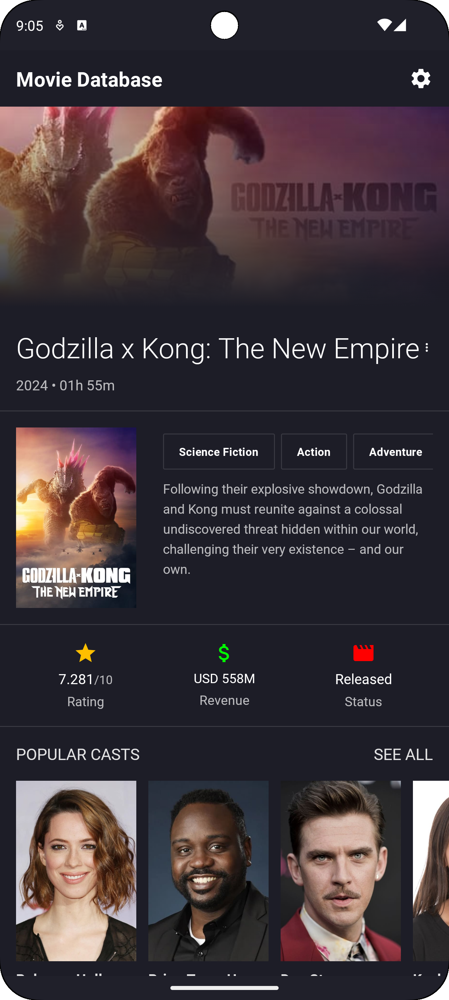
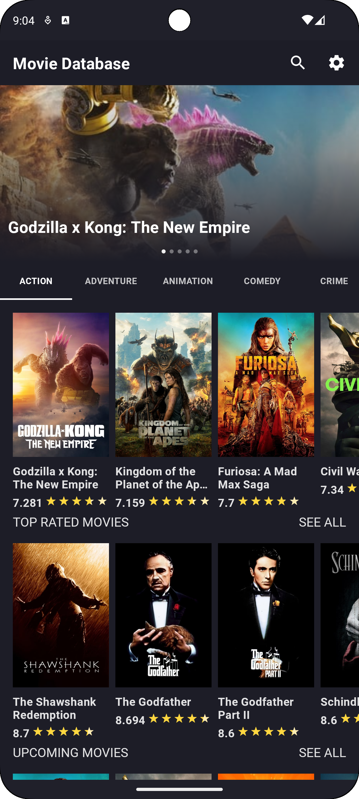

# Movie Database App

## Overview

Movie Database App is a mobile application built for Android using Jetpack Compose. The app provides users with a comprehensive movie database where they can browse and view details of various movies. The app features a clean and intuitive UI, making it easy to navigate through different categories and discover new films.

## Features

- **Movie List**: Browse a list of movies with the ability to scroll through various titles.
- **Movie Details**: View detailed information about a selected movie, including synopsis, cast, ratings, and more.
- **Carousel View**: Enjoy a carousel of movie posters for a visually appealing browsing experience.
- **Category Tabs**: Easily switch between different categories of movies such as Popular, Top Rated, Upcoming, etc.

## Technologies Used

- **Jetpack Compose**: Modern toolkit for building native Android UI.
- **Kotlin**: Primary programming language for Android development.
- **MVVM Architecture**: Separates the development of UI and business logic to improve code maintainability and testability.
- **ViewModel**: Manage UI-related data in a lifecycle-conscious way.
- **Flow**: Handle asynchronous streams of data.
- **Retrofit**: A type-safe HTTP client for Android and Java to make network requests.

## Screenshots

<div style="display: flex; flex-direction: row; justify-content: space-around;">
    <div>
        <h3>Home Screen</h3>
        
    </div>
    <div>
        <h3>Movie Details</h3>
        
    </div>
</div>


## Installation

1. Clone the repository:
   ```bash
   git clone https://github.com/ihsaninh/Movie-DB-Jetpack-Compose.git
   ```
2. Open the project in Android Studio.
3. Sync the project with Gradle files.
4. Build and run the app on an Android device or emulator.

## Usage

- Open the app to view a list of movies.
- Scroll through the carousel to see featured movies.
- Tap on a movie to view detailed information.
- Use the category tabs to filter movies by different criteria.

## Contact

For any inquiries or feedback, please contact:

- Ihsan Nurul Habib
- [ihsan.inh@gmail.com](mailto:ihsan.inh@gmail.com)
- [GitHub](https://github.com/ihsaninh)

---

Thank you for using the Movie Database App! Enjoy exploring and discovering new movies.
